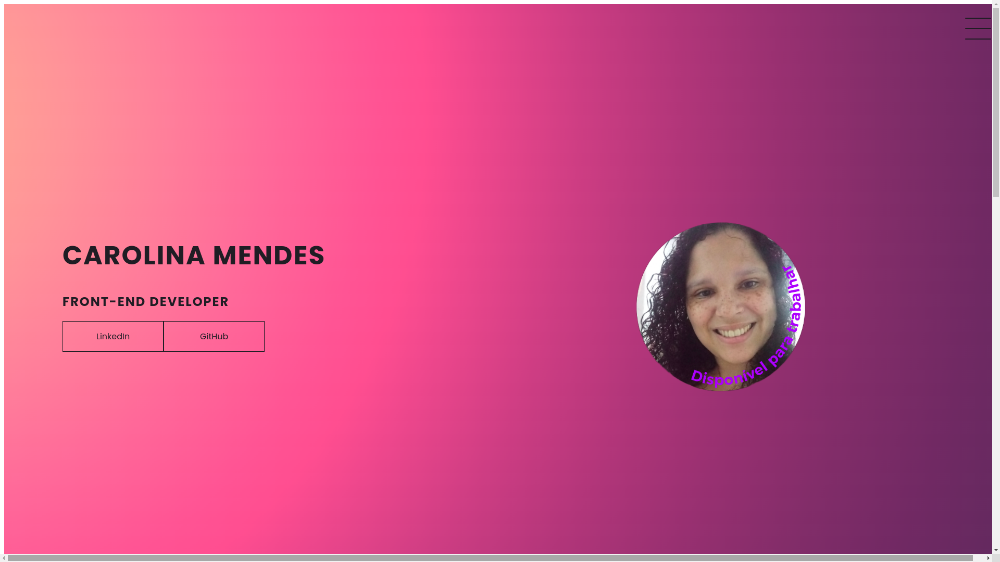
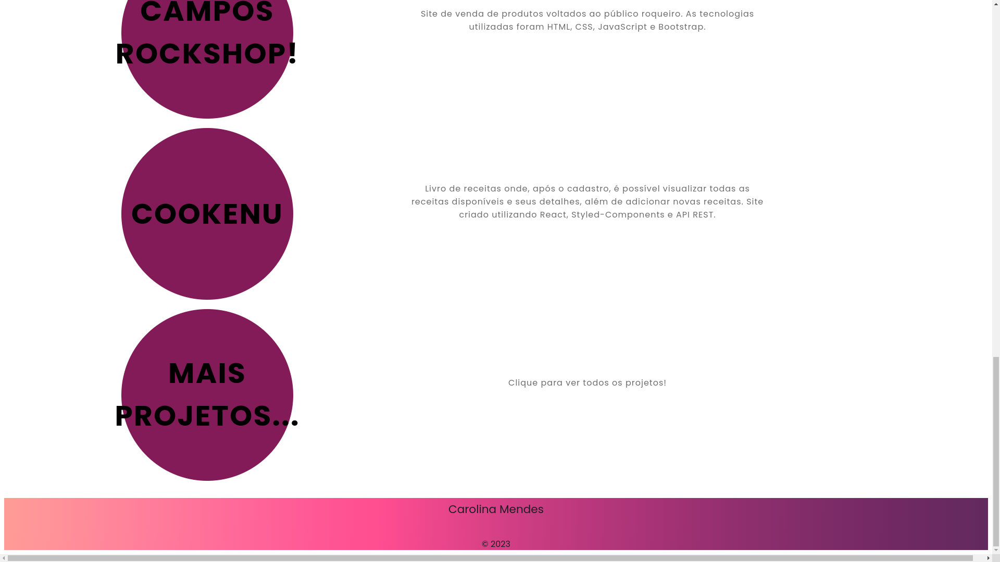
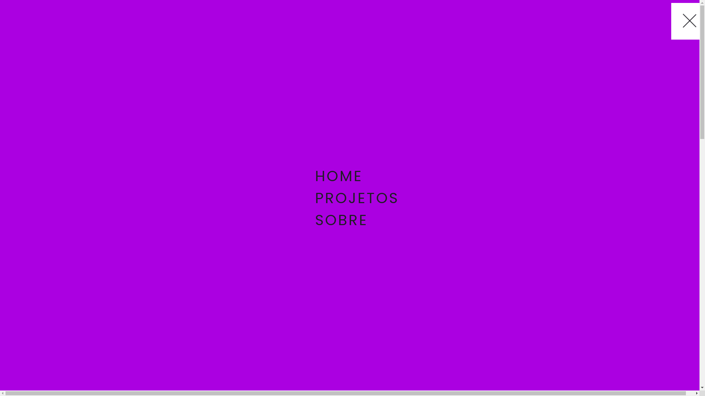
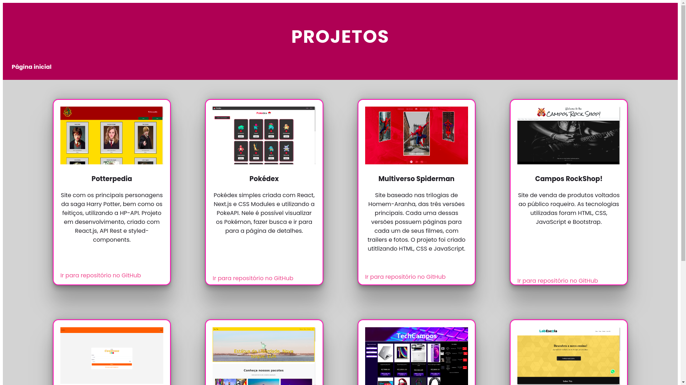
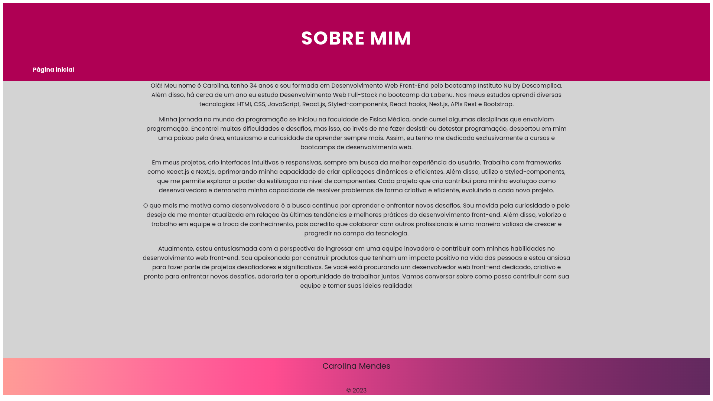

# Carolina M. Campos

Aqui você encontrará minhas informações acadêmicas e profissionais, minha trajetória e objetivos, além, é claro, dos meus projetos front-end. 

### Tecnologias utilizadas
- HTML
- CSS
- Bootstrap

### Layout

#### Homepage - Início da página

#### Homepage - Final da página

#### Menu

#### Página de projetos

#### Sobre

### Link do projeto

### Autora

##### Carolina M. Campos - Desenvolvedora Front-end